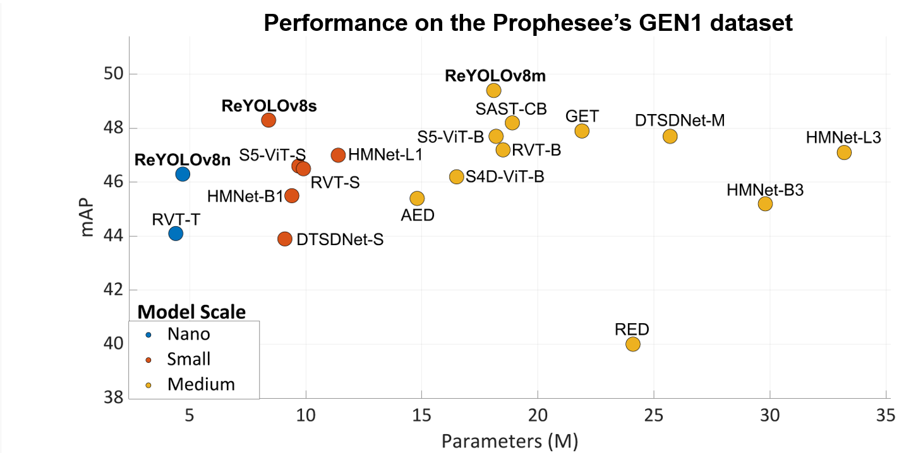

# ReYOLOv8

This repository contains the source code for "A Recurrent YOLOv8-Based Framework for Event-Based Object Detection", published in the Frontiers of Neuroscience journal under the Neuromorphic Engineering topic. <br/>




You can read the full paper on: <br/>
[Frontiers in Neuroscience - ReYOLOv8 paper](https://doi.org/10.3389/fnins.2024.1477979) <br/>

To check-out the original YOLOv8 repo, from Utralytics, you can check: <br/>
[Ultralytics' original repo](https://github.com/ultralytics/ultralytics) <br/>

# Setting up the environment 
```
conda create -n reyolov8 python==3.9
conda activate reyolov8 
conda install pytorch==1.12.1 torchvision==0.13.1 torchaudio==0.12.1 cudatoolkit=11.6 -c pytorch -c conda-forge 
python -m pip install opencv-python tqdm==4.66.2 pandas==2.2.2 numpy==1.22.4 psutil==5.9.8 pyyaml==6.0.1 matplotlib==3.8.4 thop wandb h5py==3.11.0 hdf5plugin==4.4.0 tensorboard==2.16.2 
```
# Downloading the necessary data

You can donwload the pretrained weights used in this work here:

[pretrained weights](https://drive.google.com/drive/folders/1UHIShRPFNVq1hDIUDlWC2gCz-RAbidr7?usp=drive_link)

Meanwhile, the preprocessed datasets can be found here:

[preprocessed datasets](https://drive.google.com/drive/folders/1mmzEw8Jkcz9BFocw5OqFdCLb_H8t-ue5?usp=drive_link)
# Evaluate the results of the paper

First of all, you need to open the "yaml" file to the corresponding dataset you want to test and modify the paths to the location you are using.
Then, you can run:

```
 python val.py --data ${DATASET}.yaml --model ${WEIGHTS}.pt --channels 5 --split ${SPLIT} --show_sequences ${SEQ}
```
Example: <br />
**SPLIT**: val, test <br />
**DATASET**: vtei_gen1, vtei_pedro <br />
**WEIGHTS**: weights/reyolov8s_gen1_rps <br />
**SEQ**: number of sequences you want to see the predictions, default is 3 

The speed statistics in this validation mode are given according the full sequences. To check the speed to perform inference tensor by tensor, we run:

```
 python val.py --data ${DATASET}.yaml --model ${WEIGHTS}.pt --channels 5 --split ${SPLIT} --speed
```

To evaluate the data format statistics

```
 python EventEncodingProfiler.py --folder "test_timing"
```

The folder **test_timing** has our experiments' "csv" files. 

To generate the csv files on your setup, you can first download the sequence used for us through this link:
[Sequence for data format evaluation](https://drive.google.com/file/d/1Tuey6YnQsouGtM1bFNKk2WCRAGrsh1xM/view?usp=sharing)

Then, you can generate the csv files running the following code snippet. 

```
python EventEncodingProfilerRun.py --input_file $DAT --output $OUTPUT_FOLDER --format $FMT

```

where

**AEDAT4**: the DAT file used for evaluation <br />
**OUTPUT_FOLDER**: the folder where you want to save it <br />
**FMT**: vtei, mdes, voxel_grid, or shist

Then, after running this snippet for all the formats, you can run the **{EventEncodingProfiler.py}** file again

# Training 

**Single-GPU**

The general training code is:

```
python train.py --batch ${BATCH} --nbs ${BATCH//2} --epochs ${NUM_EPOCH} --data ${DATASET}.yaml  --model ${MODEL_NAME}.yaml --channels 5 --name ${WANDB_RUN_NAME} --project ${WANDB_PROJECT_NAME}  --hyp ${HYP}.yaml --suppress ${S} --positive ${P} --zoom_out ${Z} --flip ${F} --val_epoch ${VAL_EPOCH} --clip_length ${CLIP_LENGTH} --clip_stride ${CLIP_STRIDE}
```

where:

**BATCH**: batch size <br />
**NUM_EPOCH**: number of epochs <br />
**MODEL_NAME**: ReYOLOv8n, ReYOLOv8s, or ReYOLOv8m <br />
**HYP**: Files with some hyperparameters: default_gen1 and default_pedro <br />
**S**: Suppression probability (use only if the data format is VTEI or MDES) <br />
**P**: Positive suppression probability <br />
**F**: Horizontal flip probability <br />
**Z**: Zoom-out probability <br />
**VAL_EPOCH**: Number of epochs to perform validation <br />
**CLIP_LENGTH**: Length of the clips used for training <br />
**CLIP_STRIDE**: Distance between different clips. If equal to CLIP_LENGTH, clips will not present overlap.

Other parameters such as the loss coefficients, learning rate, and weight decay can be modified in the **default.yaml** files.

To accelerate the training, we adopted some tricks:  <br />
**1-** We validated only at each 10 epochs <br />
**2-** During training, instead of running the validation steps on full sequences, we divided the **val** set into batches that can be processed faster. <br />
**3-** On the training pipeline, only the final validation step over the **test** set is calculated over full sequences. <br />
**4-** Values reported in the paper that refer to the **val** set come from running **val.py** after training <br />

The factor **--nbs** stands for Normalized Batch Size. It is also present in the original Ultralytics repo and is utilized to make the training more robust to different batch sizes. Accordingly, 
the Weight Decay was set taking into consideration the **nbs** and the **clip length** according to:

```
W_Decay = W0*Batch_size*Clip_Length/NBS
```
Where **W0** is the weight decay defined in the default files and **W_Decay** is the one adopted during training (and reported on the paper)

**Reproduce our training**

```
#PEDRo: ReYOLOv8n
python train.py --batch 48 --nbs 24 --epochs 100 --data vtei_pedro.yaml  --model ReYOLOv8n.yaml --channels 5 --name ${WANDB_RUN_NAME} --project ${WANDB_PROJECT_NAME}  --hyp default_pedro.yaml --suppress 0.125 --positive 0.25 --zoom_out 0.2 --flip 0.5 --val_epoch 10 --clip_length 5 --clip_stride 5

#PEDRo: ReYOLOv8s
python train.py --batch 48 --nbs 24 --epochs 100 --data vtei_pedro.yaml  --model ReYOLOv8s.yaml --channels 5 --name ${WANDB_RUN_NAME} --project ${WANDB_PROJECT_NAME}  --hyp default_pedro.yaml --suppress 0.05 --positive 0.50 --zoom_out 0.2 --flip 0.5 --val_epoch 10 --clip_length 5 --clip_stride 5

#PEDRo: ReYOLOv8m
python train.py --batch 48 --nbs 24 --epochs 100 --data vtei_pedro.yaml  --model ReYOLOv8m.yaml --channels 5 --name ${WANDB_RUN_NAME} --project ${WANDB_PROJECT_NAME}  --hyp default_pedro.yaml --suppress 0.125 --positive 0.50 --zoom_out 0.2 --flip 0.5 --val_epoch 10 --clip_length 5 --clip_stride 5

#GEN1: ReYOLOv8n
python train.py --batch 48 --nbs 24 --epochs 100 --data vtei_pedro.yaml  --model ReYOLOv8n.yaml --channels 5 --name ${WANDB_RUN_NAME} --project ${WANDB_PROJECT_NAME}  --hyp default_pedro.yaml --suppress 0.25 --positive 0.25 --zoom_out 0.5 --flip 0.5 --val_epoch 10 --clip_length 11 --clip_stride 11

#GEN1: ReYOLOv8s
python train.py --batch 48 --nbs 24 --epochs 100 --data vtei_pedro.yaml  --model ReYOLOv8s.yaml --channels 5 --name ${WANDB_RUN_NAME} --project ${WANDB_PROJECT_NAME}  --hyp default_pedro.yaml --suppress 0.05 --positive 0.50 --zoom_out 0.5 --flip 0.5 --val_epoch 10 --clip_length 11 --clip_stride 11

#GEN1: ReYOLOv8m
python train.py --batch 48 --nbs 24 --epochs 100 --data vtei_pedro.yaml  --model ReYOLOv8m.yaml --channels 5 --name ${WANDB_RUN_NAME} --project ${WANDB_PROJECT_NAME}  --hyp default_pedro.yaml --suppress 0.05 --positive 0.50 --zoom_out 0.5 --flip 0.5 --val_epoch 10 --clip_length 11 --clip_stride 11
```

**Multi-GPU** 

```
torchrun --nnodes 1  --nproc_per_node 2  train.py --device [0,1] --batch ${BATCH} --nbs ${BATCH//2} --epochs ${NUM_EPOCH} --data ${DATASET}.yaml  --model ${MODEL_NAME}.yaml --channels 5 --name ${WANDB_RUN_NAME} --project ${WANDB_PROJECT_NAME}  --hyp ${HYP}.yaml --suppress ${S} --positive ${P} --zoom_out ${Z} --flip ${F} --val_epoch ${VAL_EPOCH} --clip_length ${CLIP_LENGTH} --clip_stride ${CLIP_STRIDE}
```

# Raw Datasets 

The raw datasets used in this work can be found on the following links:

- **GEN1**: [Prophesee Gen1 Automotive Detection Dataset](https://www.prophesee.ai/2020/01/24/prophesee-gen1-automotive-detection-dataset/)
- **PEDRo**: [PEDRo Event-Based Dataset](https://github.com/SSIGPRO/PEDRo-Event-Based-Dataset)

# Converting Raw Datasets to ReYOLOv8 compatible formats

**GEN1**
```
#python singleShot_eventDataHandler_GEN1.py --timeWindow ${T} --dataset GEN1 --category "train" --source ${RAW_DATASET_FOLDER} --destination ${CONVERTED_DATASET_FOLDER} --method ${FMT} --bins ${TBIN}
#python singleShot_eventDataHandler_GEN1.py --timeWindow ${T} --dataset GEN1 --category "val" --source ${RAW_DATASET_FOLDER} --destination ${CONVERTED_DATASET_FOLDER} --method ${FMT} --bins ${TBIN}
#python singleShot_eventDataHandler_GEN1.py --timeWindow ${T} --dataset GEN1 --category "test" --source ${RAW_DATASET_FOLDER} --destination ${CONVERTED_DATASET_FOLDER} --method ${FMT} --bins ${TBIN}
```

**PeDRo**
```
#python singleShot_eventDataHandler_pedro.py --timeWindow ${T} --dataset pedro --category "train" --source ${RAW_DATASET_FOLDER} --destination ${CONVERTED_DATASET_FOLDER} --method ${FMT} --bins ${TBIN}
#python singleShot_eventDataHandler_pedro.py --timeWindow ${T} --dataset pedro --category "val" --source ${RAW_DATASET_FOLDER} --destination ${CONVERTED_DATASET_FOLDER} --method ${FMT} --bins ${TBIN}
#python singleShot_eventDataHandler_pedro.py --timeWindow ${T} --dataset pedro --category "test" --source ${RAW_DATASET_FOLDER} --destination ${CONVERTED_DATASET_FOLDER} --method ${FMT} --bins ${TBIN}
```

**T**: time-window for creating the encodings. We used 50 for GEN1 and 40 for PeDRo. <br />
**CONVERTED_DATASET_FOLDER**: destination folder <br />
**RAW_DATASET_FOLDER**: folder where the raw dataset is stored <br />
**FMT**: vtei, mdes, voxel_grid, or shist. <br />
**TBIN**: number of channels of the encoding. For **SHIST and VOXEL_GRIDs**, the final number of channels will be **2TBIN**


Remarks: **Do not use Random Polariy Suppression if you choose SHIST or VOXEL_GRID as methods**
# Code Acknowledgements

- https://github.com/ultralytics/ultralytics
- https://github.com/MichiganCOG/vip
- https://github.com/uzh-rpg/RVT

# Cite this work
```
@article{silva2025recurrent,
  title={A recurrent YOLOv8-based framework for event-based object detection},
  author={Silva, Diego A and Smagulova, Kamilya and Elsheikh, Ahmed and Fouda, Mohammed E and Eltawil, Ahmed M},
  journal={Frontiers in Neuroscience},
  volume={18},
  pages={1477979},
  year={2025},
  publisher={Frontiers Media SA}
}
```
